[GitHub - (dokudami)](https://github.com/ysdzm)

## ゲーム

- Twinstボス戦（2020）
    - リンク：[Twinst - NITMic](https://nitmic.club.nitech.ac.jp/post/0004/)
    - 画像：
        - 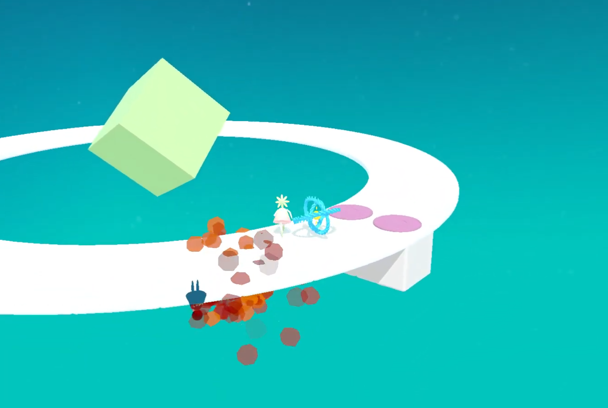  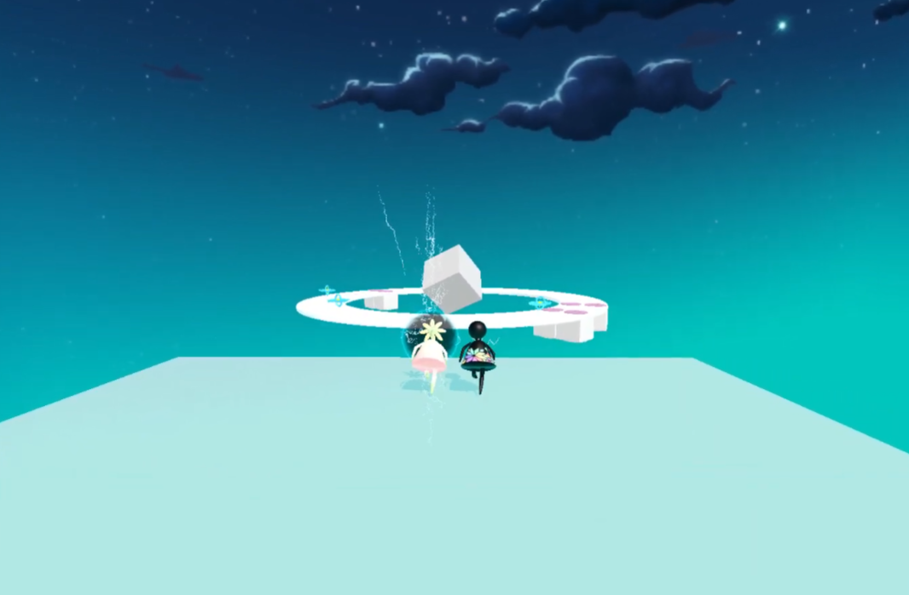

- もう一人の自分探し（2021）
    - リンク：[もう一人の自分探し(2021) IVRC History Archive](https://ivrc.net/archive/%E3%82%82%E3%81%86%E4%B8%80%E4%BA%BA%E3%81%AE%E8%87%AA%E5%88%86%E6%8E%A2%E3%81%972021/)
    - 画像：
        - 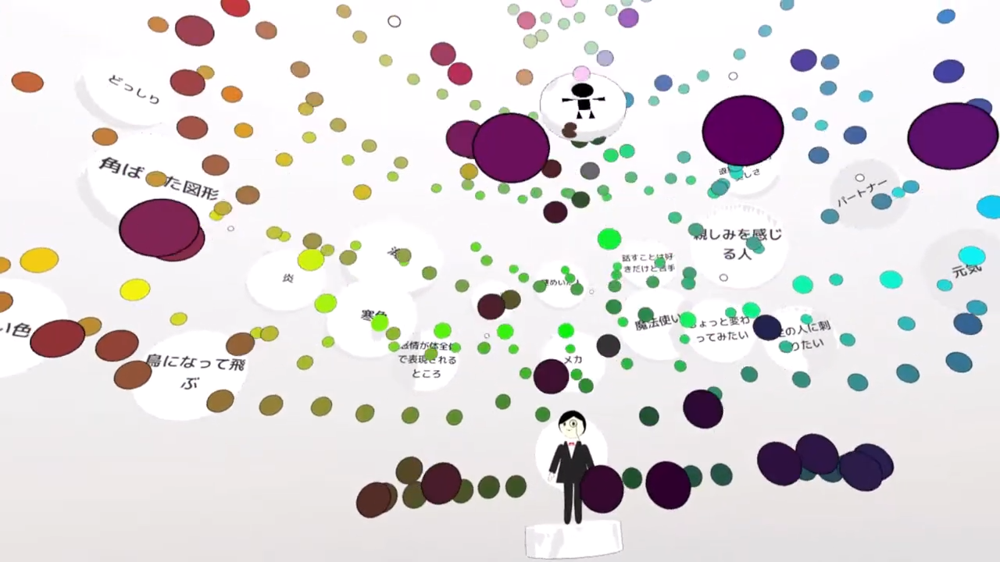 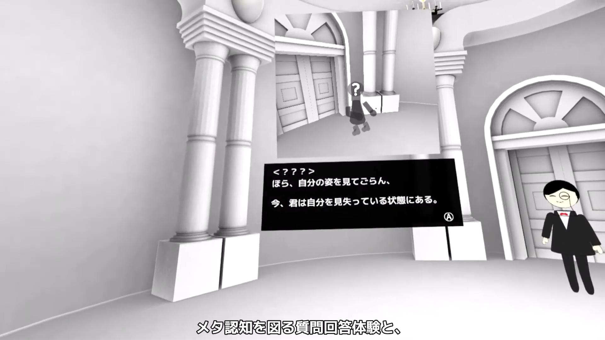 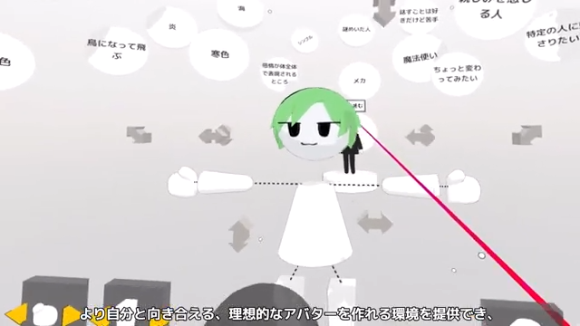 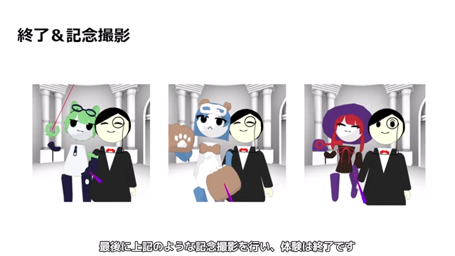

- nitechRacing（2021）
    - リンク：なし
    - 画像：
        - 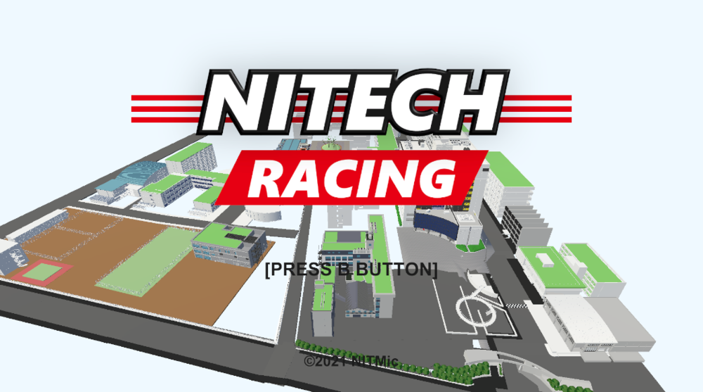
- GlideGirl（2022）
    - リンク：なし
    - 画像：
        - 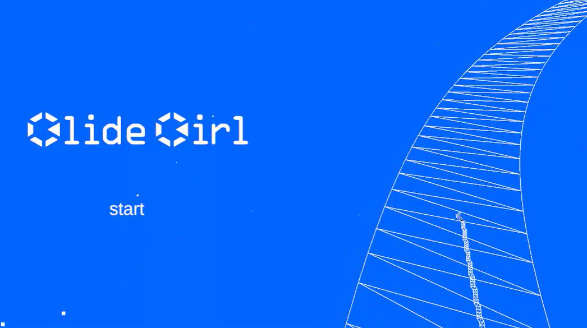 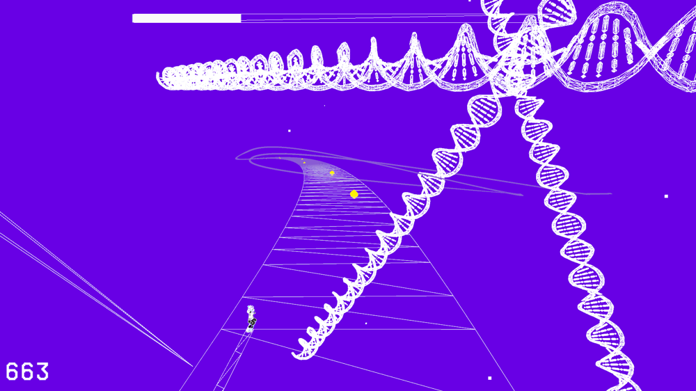  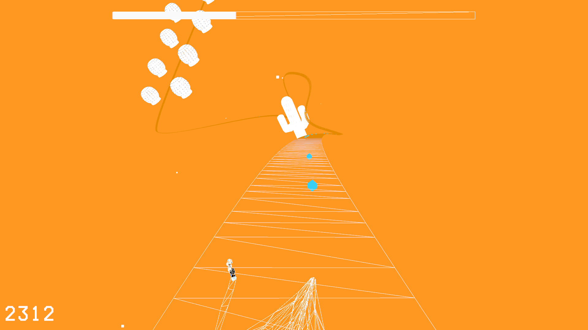

## Web

- サークルWebサイト
    - 概要：
    - リンク：[nitmic/nitmic-website: 名古屋工業大学コンピュータ俱楽部 NITMic の公式ウェブサイト](https://github.com/nitmic/nitmic-website)
- 個人サイト
    - 概要：
    - リンク：[Home dokudamibox.net](https://dokudamibox.net/)
- 名工大大学院履修チェッカー
    - 概要：
    - リンク：[ysdzm/nitech-daigakuin-rishu-checker: 名古屋工業大学の大学院履修登録をチェックするWebアプリ](https://github.com/ysdzm/nitech-daigakuin-rishu-checker)

## その他

- IroShpere-vrm
    - 概要：
    - リンク：[ysdzm/IroSphere-vrm](https://github.com/ysdzm/IroSphere-vrm)
    - 画像：
        - 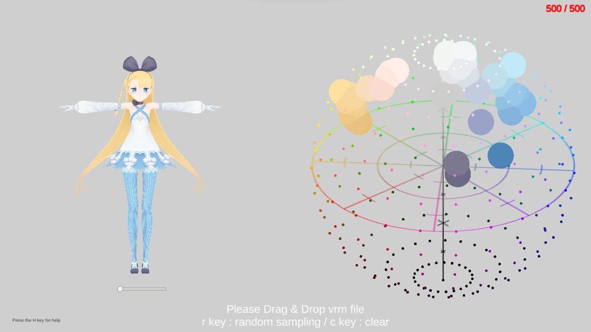
- python-make-git
    - 概要：
    - リンク：[ysdzm/python-make-git: pythonでgitの挙動をシミュレートしたい](https://github.com/ysdzm/python-make-git)
- identicon-model
    - 概要：
    - リンク：[identicon-model フリーゲーム投稿サイト unityroom](https://unityroom.com/games/identicon-model)
    - 画像：
        - 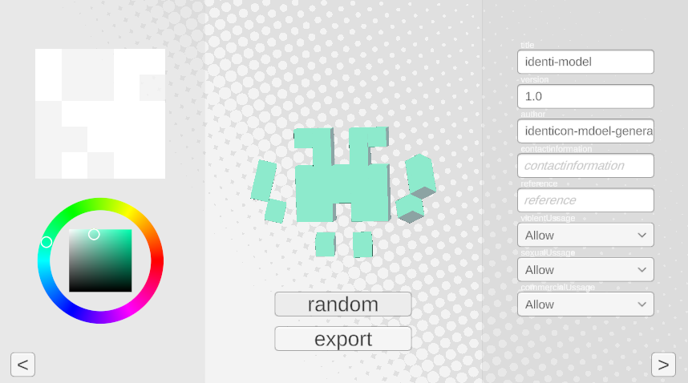
- identicon-model-maker
    - 概要：
    - リンク：なし
    - 画像：
        - 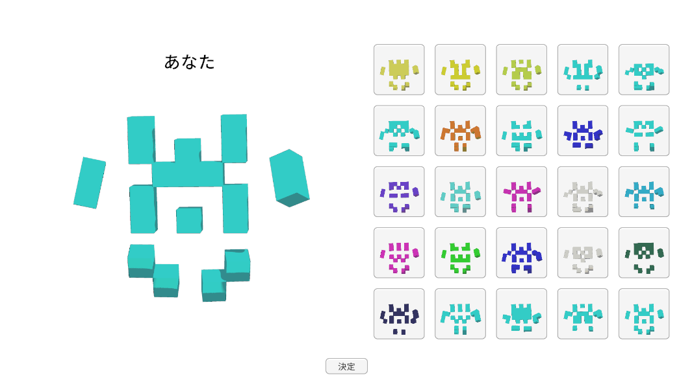
- おえかきBlendShape（pixivハッカソン）
    - リンク：[【C0de*pixivハッカソン】おえかきBlendShape - 道端のドクダミ](https://dokudamichang.hatenablog.com/entry/2024/02/10/034112)
    - 画像：
        - 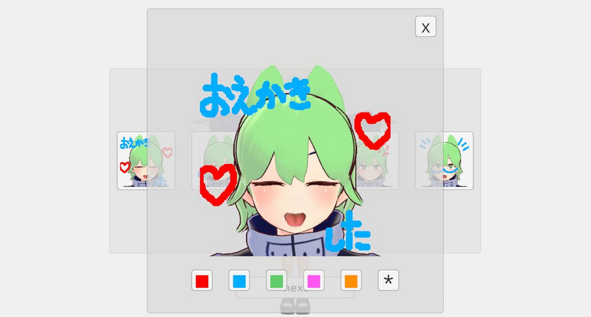

## 3Dモデル
- バーチャル名工大
- 256fes
- mekakureMaid