## リンク

- <https://github.com/ysdzm>
- <https://qiita.com/dokudami>
- <https://dokudamichang.hatenablog.com/archive>
- <https://blog.dokudamibox.net/>

## ゲーム

### Twinst ボス戦（2020）
- 概要：
    - 大学サークルで作成したゲーム。ボス戦のプログラムを担当。Unity。
- リンク：
    - <https://nitmic.club.nitech.ac.jp/post/0004/>
- 画像：
    - <a href="images/image.png" target="_blank">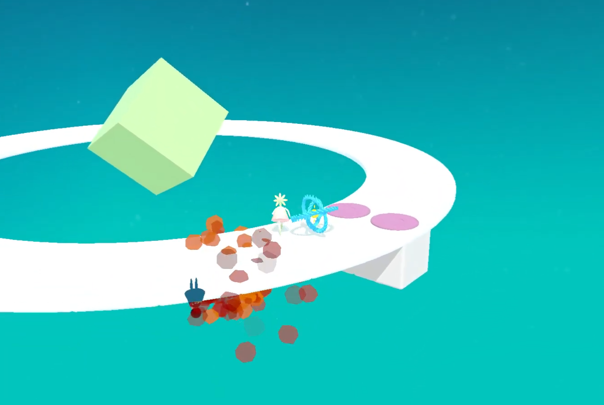</a> <a href="images/image-1.png" target="_blank">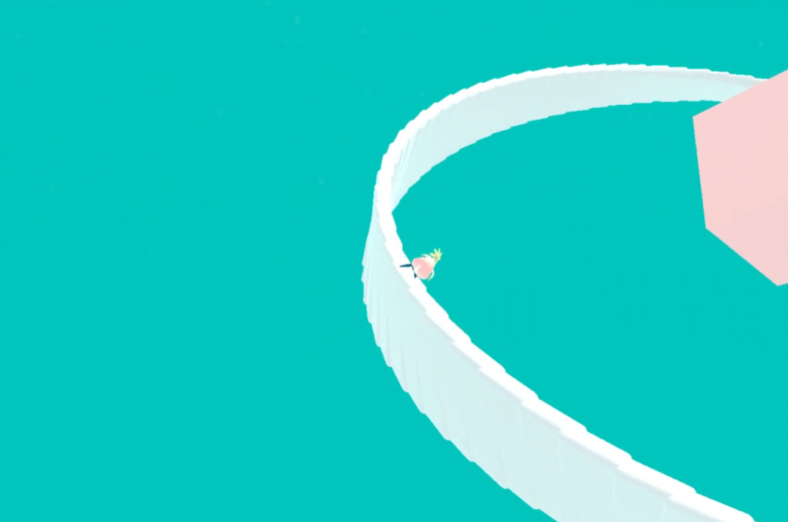</a> <a href="images/image-2.png" target="_blank">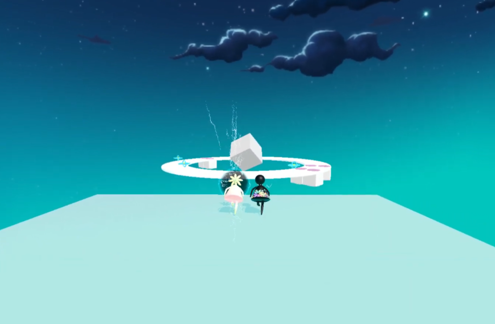</a>

### もう一人の自分探し（2021）
- 概要：
    - IVRC2021に向けて作成した作品。プログラムを担当。
- リンク：
    - [もう一人の自分探し(2021) IVRC History Archive](https://ivrc.net/archive/%E3%82%82%E3%81%86%E4%B8%80%E4%BA%BA%E3%81%AE%E8%87%AA%E5%88%86%E6%8E%A2%E3%81%972021/)
- 画像：
    - <a href="images/image-7.png" target="_blank">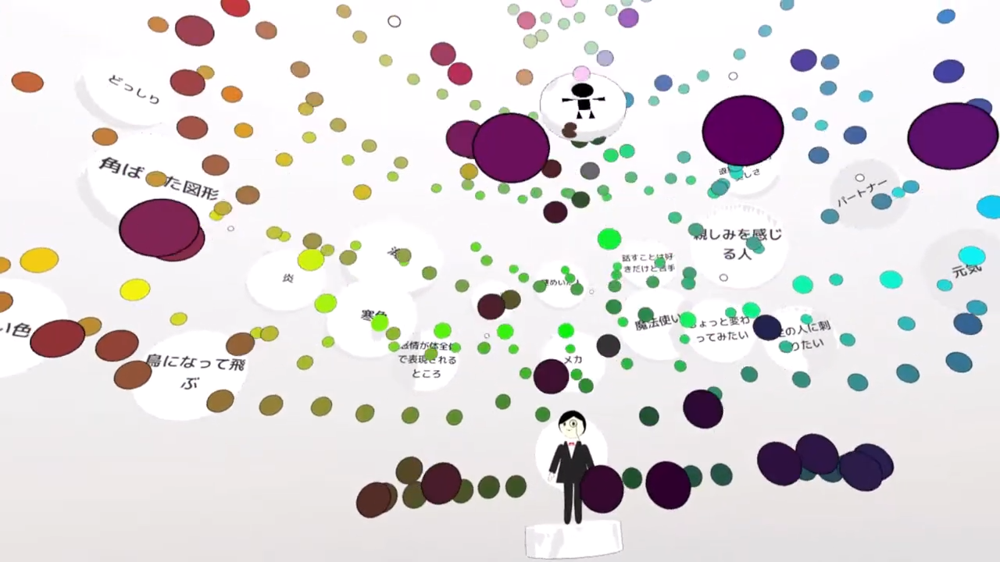</a> <a href="images/image-9.png" target="_blank">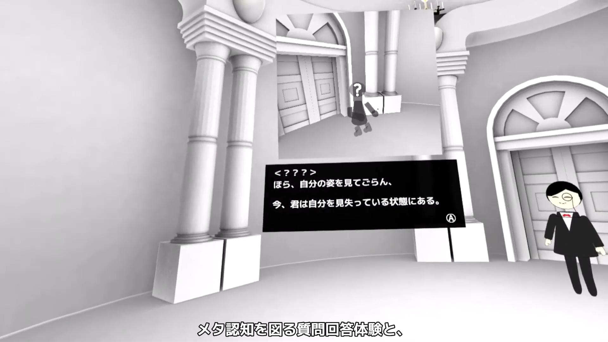</a> <a href="images/image-19.png" target="_blank">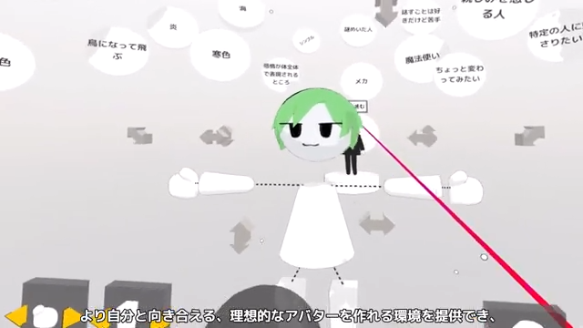</a> <a href="images/image-20.png" target="_blank">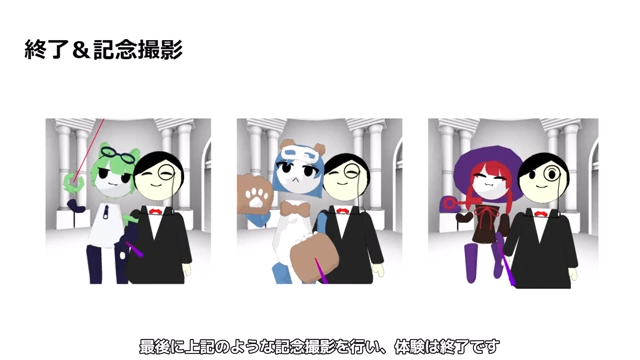</a>

### nitechRacing（2021）
- 概要：
    - 大学サークルで作成したゲーム。プログラムを担当。Unity。
- リンク：
    - なし
- 画像：
    - <a href="images/image-14.png" target="_blank">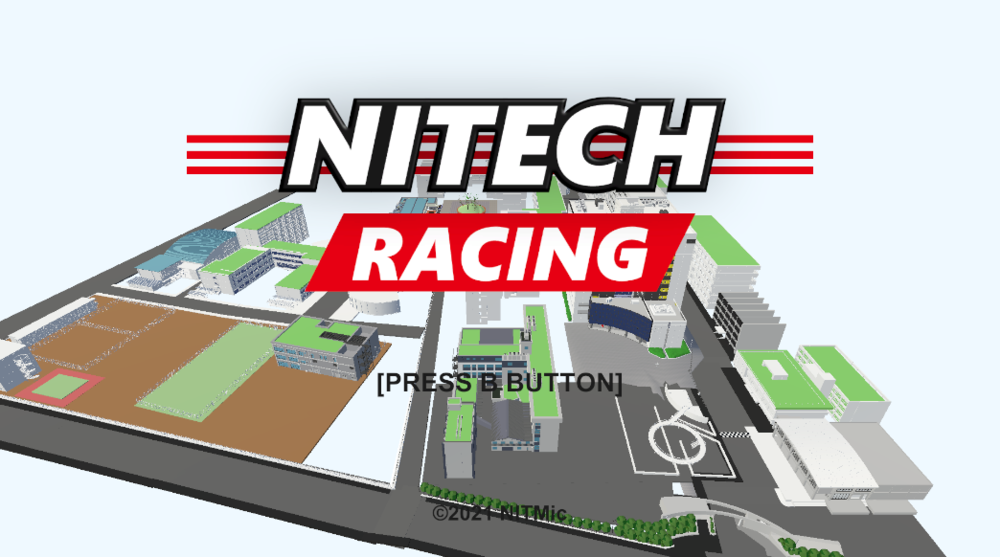</a>

### GlideGirl（2022）
- 概要：
    - 大学サークルで作成したゲーム。プログラムを担当。Unity。
- リンク：
    - <https://nitmic.club.nitech.ac.jp/post/glide-girl/>
- 画像：
    - <a href="images/image-12.png" target="_blank">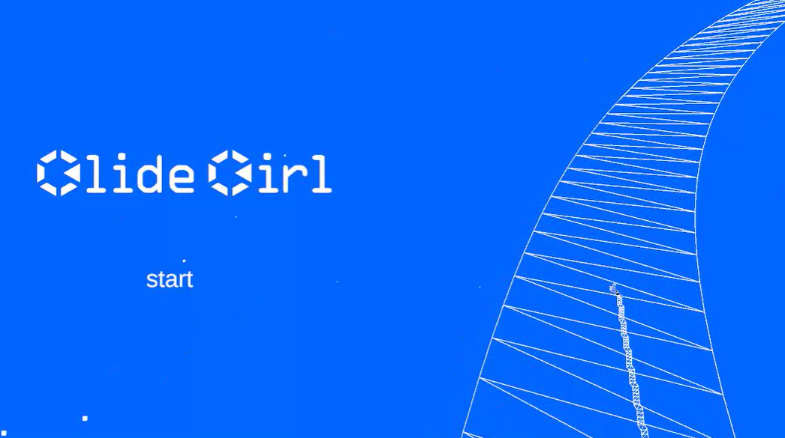</a> <a href="images/image-3.png" target="_blank">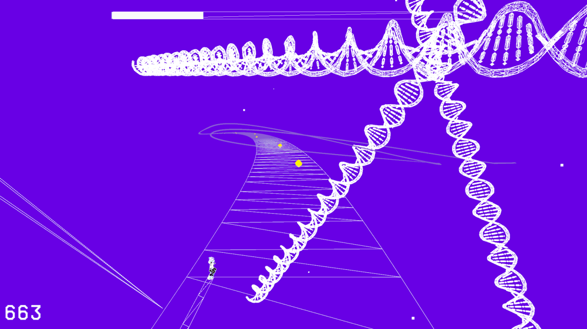</a> <a href="images/image-4.png" target="_blank">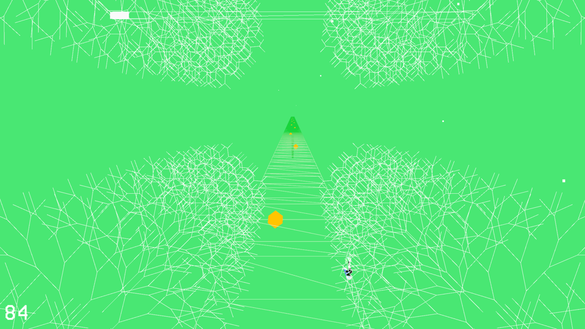</a> <a href="images/image-5.png" target="_blank">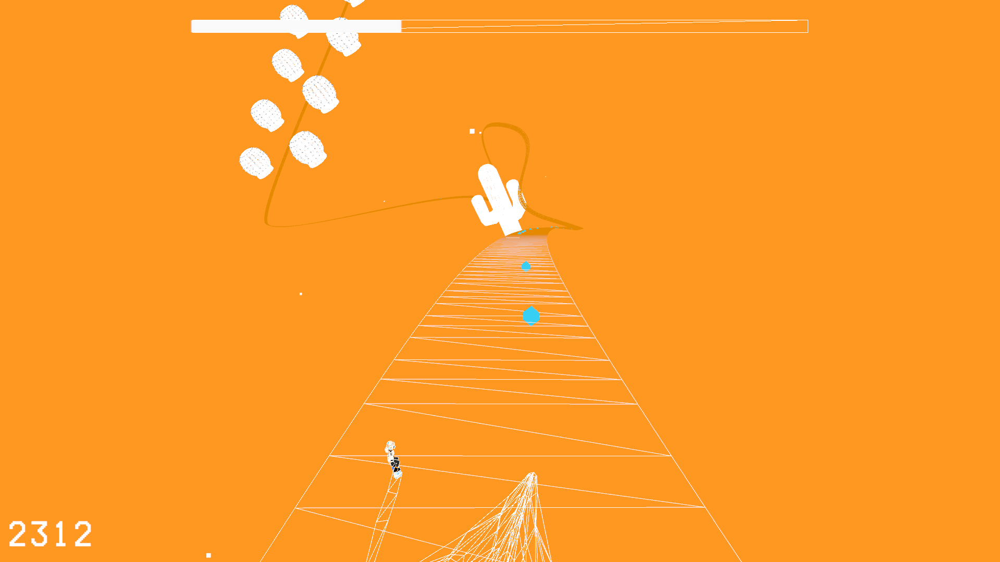</a>

## Web

### サークルWebサイト
- 概要：
    - 大学サークルのWebサイトの初期実装を担当。HUGO（Go）。
- リンク：
    - <https://github.com/nitmic/nitmic-website>
- 画像：
    - <a href="images/image-15.png" target="_blank">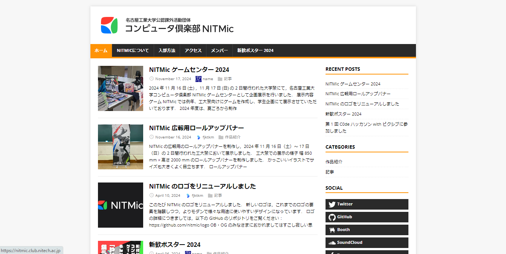</a>

### 個人サイト
- 概要：
    - 個人サイト。React製。
- リンク：
    - <https://blog.dokudamibox.net/>
- 画像：
    - <a href="images/image-16.png" target="_blank">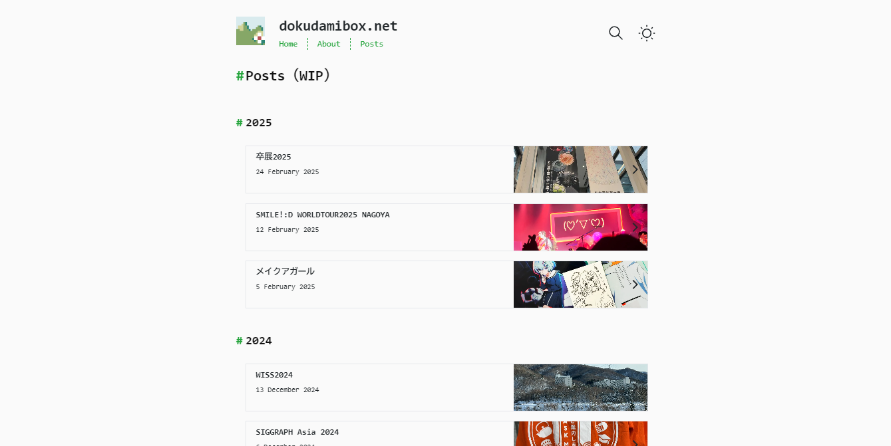</a>

### 名工大大学院履修チェッカー
- 概要：
    - 大学院の履修要件を確認するサイト。Next.js製。WIP。
- リンク：
    - [ysdzm/nitech-daigakuin-rishu-checker: 名古屋工業大学の大学院履修登録をチェックするWebアプリ](https://github.com/ysdzm/nitech-daigakuin-rishu-checker)

## その他

### OculusQuestハンドトラッキング
- 概要：
    - OculusQuestハンドトラッキングでキャラクターを操ったもの。Unity。
- リンク：
    - [Midnight tension - YouTube](https://www.youtube.com/watch?v=BEyPwZgyrFE&embeds_referring_euri=https%3A%2F%2Fdokudamibox.net%2F)
- 画像：
    - <a href="images/image-29.png" target="_blank">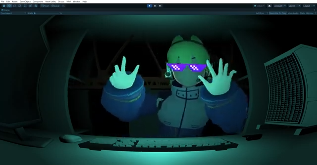</a> <a href="images/image-30.png" target="_blank">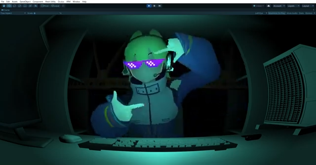</a> <a href="images/image-33.png" target="_blank">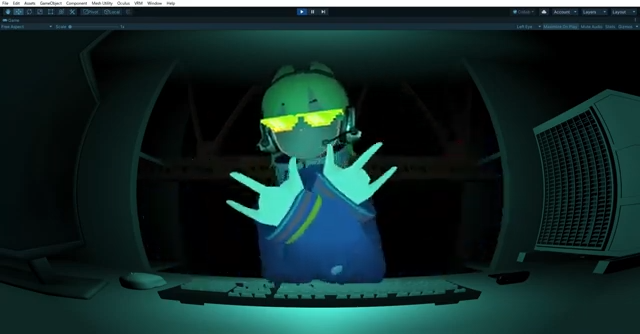</a>

### IroShpere-vrm
- 概要：
    - IroSphereをvrmに対応させたもの。Unity。
- リンク：
    - [ysdzm/IroSphere-vrm](https://github.com/ysdzm/IroSphere-vrm)
- 画像：

  <a href="images/image-13.png">
    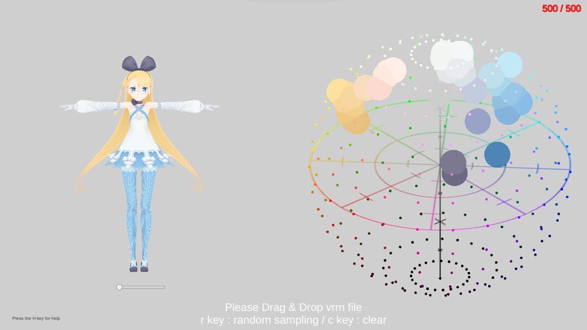
  </a>

### python-make-git
- 概要：
    - LTの企画としてgitをpythonで再実装したもの。Python。
- リンク：
    - [ysdzm/python-make-git: pythonでgitの挙動をシミュレートしたい](https://github.com/ysdzm/python-make-git)

### おえかきBlendShape（pixivハッカソン）
- 概要：
    - vrmモデルの表情にラクガキができるようにするアプリ。Unity。
- リンク：
    - [【C0de*pixivハッカソン】おえかきBlendShape - 道端のドクダミ](https://dokudamichang.hatenablog.com/entry/2024/02/10/034112)
- 画像：

  <a href="images/image-13-1.png">
    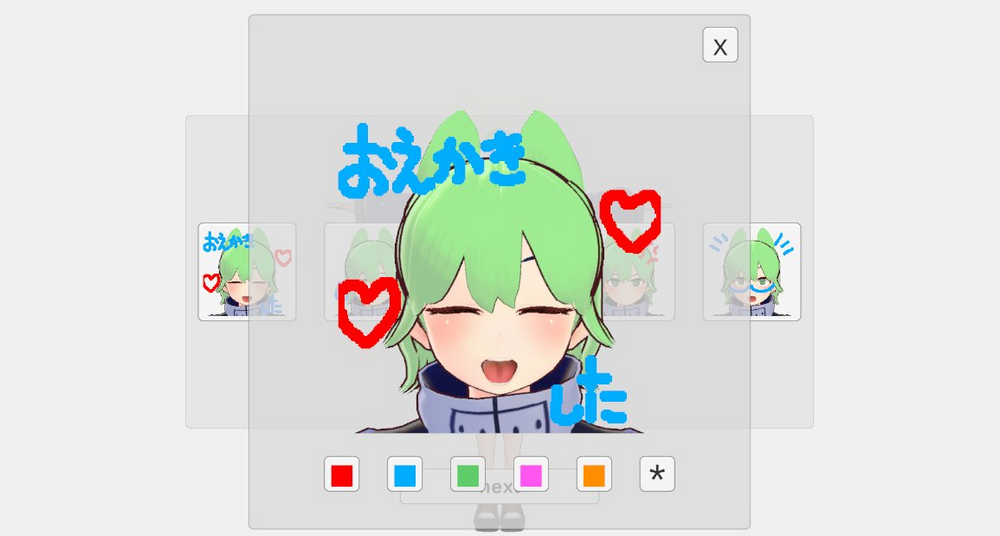
  </a>

## 研究

### identicon-model
- 概要：
    - identiconを3Dモデル拡張したidenticon-modelを作ってみたもの。Unity。
- リンク：
    - [identicon-model フリーゲーム投稿サイト unityroom](https://unityroom.com/games/identicon-model)
- 画像：

  <a href="images/image-11.png">
    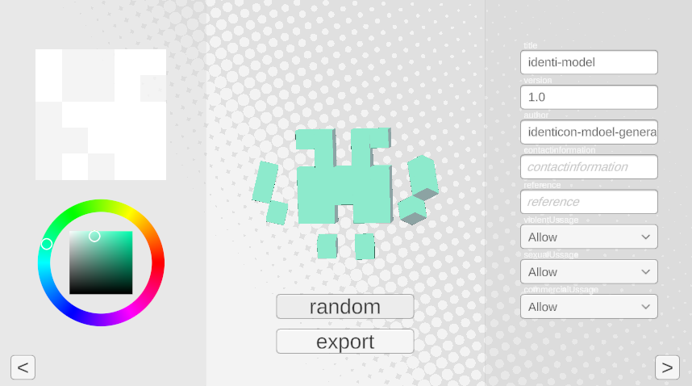
  </a>

### identicon-model-maker
- 概要：
    - identicon-modelを題材としてキャラクター作成インタフェースを提案したもの。Unity。
- リンク：
    - [情報処理学会第86回全国大会 identicon-modelを用いたアバタ作成のための探索的デザイン補助キャラクター作成インタフェース](https://www.ipsj.or.jp/event/taikai/86/WEB/data/pdf/2ZF-05.html)
- 画像：

  <a href="images/image-6.png">
    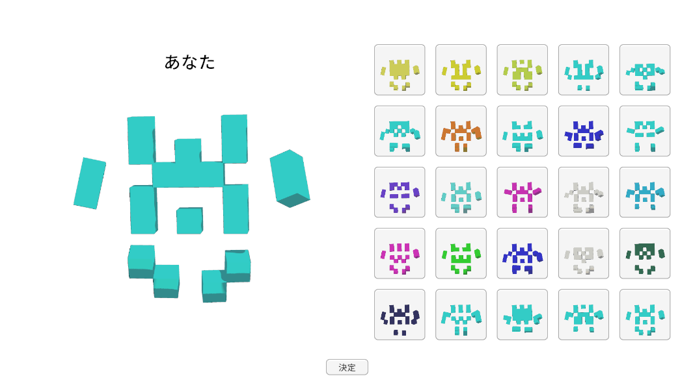
  </a>

### 人流可視化システム
- 概要：
    - 人流を凝集して可視化するシステムを実装したもの。Unity。
- リンク：
    - [wiss.org/WISS2024Proceedings/data/demo//3-A04.pdf](https://www.wiss.org/WISS2024Proceedings/data/demo//3-A04.pdf)
- 画像：

  <a href="images/image-34.png">
    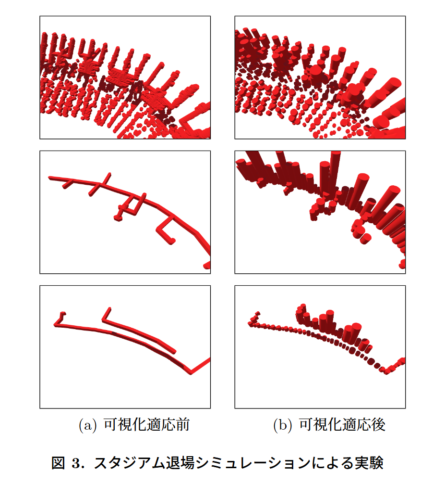
  </a>

  

## 3Dモデル

### バーチャル名工大
- 概要：
    - 大学をモデリングしたもの。Blender。
- リンク：
    - [バーチャル名工大正門前ver4.0｜メタバースプラットフォーム cluster（クラスター）](https://cluster.mu/w/f4c89c0d-720e-42b7-ad00-883c00e283c1)
- 画像：

  <a href="images/image-24.png">
    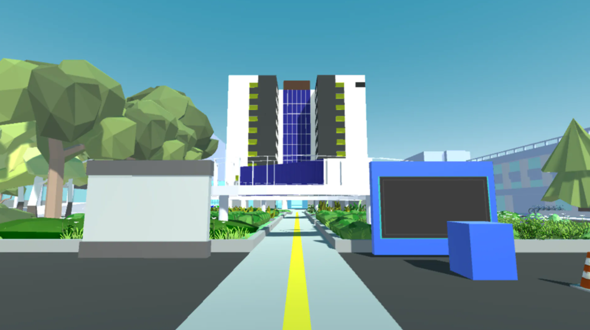
  </a>

  <a href="images/image-16-1.png">
    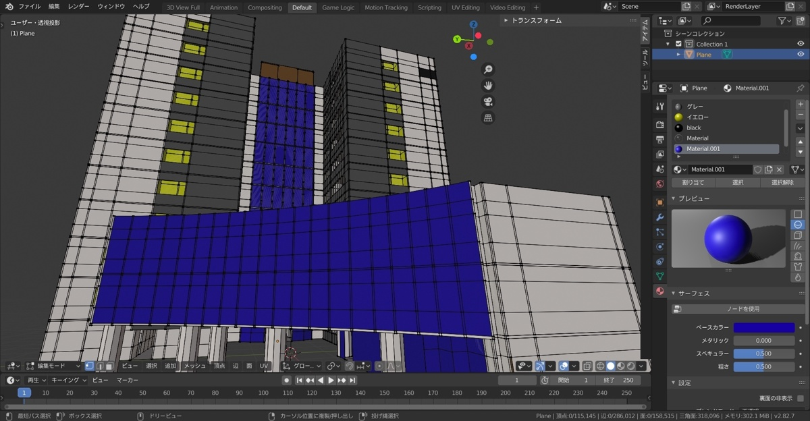
  </a>

## 謝辞
- チーム開発においてご協力いただいた大学サークルの部員の皆様に、心より感謝の意を表します。

<link rel="stylesheet" href="https://unpkg.com/photoswipe@5.4.2/dist/photoswipe.css">

  

  

